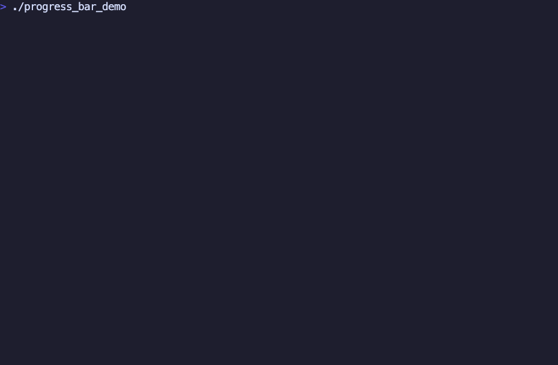

<div align="center">

# progress_bar

[](https://www.eiffel.com/)
[](https://www.gobosoft.com/)
[](https://github.com/samedit66/progress_bar/actions/workflows/ci.yml)

Terminal progress bars for Eiffel. Void-safe, ELKS-only, with synchronous output
to standard output and support for EiffelStudio and Gobo.



</div>

## Quick start

Make a bar with a known count of steps:

```eiffel
local
    bar: PB_PROGRESS_BAR
do
    create bar.make_with_total (10)
    from until bar.has_finished loop
        do_work
        bar.advance -- Same as `bar.advance_by (1)`
    end
end
```

Replace `do_work` with your operation. Reaching the total finishes the bar.

Use `PB_WRAPPED_BAR [G]`, inspired by Python's [tqdm](https://github.com/tqdm/tqdm),
to wrap an existing iterable. A finite iterable supplies the bar's total; an
unknown-size iterable uses the unknown-total form:

```eiffel
local
    bar: PB_WRAPPED_BAR [STRING]
do
    create bar.wrap (<< "this", "and that", "and also that" >>)

    across bar as item loop
        do_work (item) -- `item` is a string from `items`
    end
end
```

To print text without breaking a running bar, use the `put_line` feature. It is
available on both `PB_PROGRESS_BAR` and `PB_WRAPPED_BAR`:

```eiffel
local
    bar: PB_PROGRESS_BAR
do
    create bar.make_with_total (10_000)
    from until bar.has_finished loop
        if bar.absolute_progress \\ 100 = 3 then
            bar.put_line ("Magic number: " + bar.absolute_progress.out)
        end

        bar.advance
    end
end
```

To show several bars at once, connect them via `PB_MULTIPLE_PROGRESS_RENDERER`:

```eiffel
local
    first, second: PB_PROGRESS_BAR
    group: PB_MULTIPLE_PROGRESS_RENDERER
do
    create first.make_with_total (10)
    create second.make_with_total (20)
    create group.make (<< first, second >>)
    first.advance
    second.advance_by (3)
    first.put_line ("Working")
end
```

Create a fixed group before any of its bars are displayed. Configure each bar's
renderer before grouping. Every update redraws the group in the supplied order;
finished rows remain visible. Do not replace individual renderers while grouped.

## Formatting

Each bar starts with its own `PB_BASIC_PROGRESS_RENDERER`, showing `[current/total]`
or `[current/?]`. The library also provides these renderers, inspired by
[verigak/progress](https://github.com/verigak/progress):

- `PB_UNICODE_PROGRESS_RENDERER` — partial-block Unicode bar with a percentage;
- `PB_CHARGING_PROGRESS_RENDERER` — solid blocks with a percentage;
- `PB_SQUARES_PROGRESS_RENDERER` — filled and empty squares with a percentage;
- `PB_CIRCLES_PROGRESS_RENDERER` — filled and empty circles with a percentage;
- `PB_PIXEL_PROGRESS_RENDERER` — braille-pixel bar with a counter;
- `PB_MOON_SPINNER_RENDERER` — moon-phase spinner for indeterminate work.

To select a renderer:

```eiffel
bar.set_renderer (create {PB_UNICODE_PROGRESS_RENDERER})
```

To add elapsed time and ETA to any renderer, wrap it with
`PB_TIMING_RENDERER`:

```eiffel
bar.set_renderer (create {PB_TIMING_RENDERER}.make (
    create {PB_UNICODE_PROGRESS_RENDERER}))
```

The timing renderer displays `HH:MM:SS ETA HH:MM:SS`. ETA is shown as
`--:--:--` until a known-total bar has positive progress.

To define another presentation, inherit `PB_PROGRESS_RENDERER` and implement
`format_line (bar: PB_PROGRESS_BAR): STRING_32`. Return one physical line.
See [formatters](docs/formatters.md).

## Installation

Reference `progress_bar.ecf` from the application's ECF:

```xml
<library name="progress_bar" location="vendor/progress_bar/progress_bar.ecf" readonly="true"/>
```

The library uses standard Eiffel classes and is void-safe. Set `GOBO` to the Gobo
installation and `GOBO_EIFFEL` to `ge` or `ise` for the selected compiler.

## Development

Install `just`, Gobo, and EiffelStudio. `GOBO` defaults to `~/Projects/gobo`;
`GEC`, `GELINT`, `GETEST`, `GEDOC`, and `EC` may override tool locations.

- `just build`: compile the example with Gobo and EiffelStudio.
- `just test`: run behavioral tests with both compilers and assertions enabled.
- `just check`: analyze the library and example with both compilers.
- `just format`: format Eiffel source files.

The renderer showcase is implemented in
[examples/demo/demo_application.e](examples/demo/demo_application.e) and uses
the configuration in [examples/demo/demo.ecf](examples/demo/demo.ecf). The GIF
is a real terminal capture made with [VHS](https://github.com/charmbracelet/vhs)
from the tape in [examples/demo/demo.tape](examples/demo/demo.tape).

Tests exercise progress bounds, completion, formatters, emitted terminal sequences,
and grouped output. Test renderers override only `emit`, retaining the production
rendering behavior. CI runs both compilers on Linux, macOS, and Windows.

## Migration

The current API uses `PB_PROGRESS_BAR` and the `advance` / `advance_by` commands.
Rendering is provided by renderer classes rather than agents. Use
`PB_WRAPPED_BAR [G]` when progress should follow an iterable automatically.
Progress is exposed through the `absolute_progress` query; there is no setter.

See the [tutorial](docs/tutorial.md), [API reference](docs/reference.md), and
[example](examples/quick_start/application.e).
