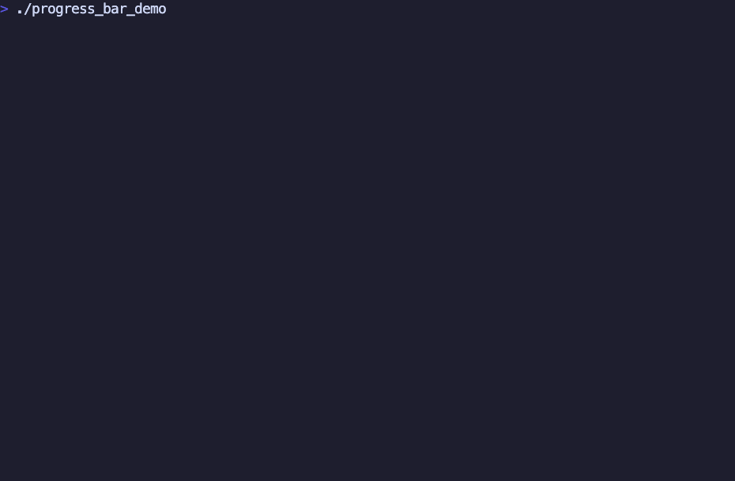

<div align="center">

# progress_bar

[](https://www.eiffel.com/)
[](https://www.gobosoft.com/)
[](https://github.com/samedit66/progress_bar/actions/workflows/ci.yml)

Terminal progress bars for Eiffel. Void-safe, ELKS-only, with synchronous output
to standard output and support for EiffelStudio and Gobo.



</div>

## Quick start

Make a bar with a known count of steps:

```eiffel
local
    bar: PB_PROGRESS_BAR
do
    create bar.make_with_total (10)

    from
    until
        bar.has_finished
    loop
        {EXECUTION_ENVIRONMENT}.sleep (100_000_000) -- Imitate some long work

        bar.advance -- Same as `bar.advance_by (1)`
    end
end
```

Reaching the total finishes the bar.

Use `PB_WRAPPED_BAR [G]`, inspired by Python's [tqdm](https://github.com/tqdm/tqdm),
to wrap an existing iterable. A finite iterable supplies the bar's total; an
unknown-size iterable uses the unknown-total form:

```eiffel
local
    bar: PB_WRAPPED_BAR [STRING]
do
    create bar.wrap (<< "this", "and that", "and also that" >>)

    across
        bar
    as
        item
    loop
        {EXECUTION_ENVIRONMENT}.sleep (100_000_000) -- Imitate some long work

        bar.put_line ("Processed: " + item) -- `item` is a string from `items`
        -- To not break the bar, we also use `put_line`, see below
    end
end
```

To print text without breaking a running bar, use the `put_line` feature. It is
available on both `PB_PROGRESS_BAR` and `PB_WRAPPED_BAR`:

```eiffel
local
    bar: PB_PROGRESS_BAR
do
    create bar.make_with_total (10_000)

    from
    until
        bar.has_finished
    loop
        if bar.absolute_progress \\ 100 = 3 then
            bar.put_line ("Magic number: " + bar.absolute_progress.out)
        end

        bar.advance
    end
end
```

To show several bars at once, connect them via `PB_DISPLAY`:

```eiffel
local
    first, second: PB_PROGRESS_BAR
    display: PB_DISPLAY
do
    create first.make_with_total (10)
    create second.make_with_total (20)

    create display.make
    display.extend (first)
    display.extend (second)

    first.advance
    second.advance_by (3)
    first.put_line ("Working")
end
```

Create a display before its bars are displayed. Every update redraws the bars in
the order supplied to `extend`; finished rows remain visible.

## Formatting

The library provides a set of preconfigured formatter styles. See the
[formatter guide](docs/formatters.md) for examples and configuration details.

Available styles include:

- standard cell bars with percentages and timing;
- phase spinners for work with no known total;
- counters and countdowns;
- compact single-glyph progress indicators;
- bars using alternative character sets.

## Installation

Reference `progress_bar.ecf` from the application's ECF:

```xml
<library name="progress_bar" location="vendor/progress_bar/progress_bar.ecf" readonly="true"/>
```

The library uses standard Eiffel classes and is void-safe. Set `GOBO` to the Gobo
installation and `GOBO_EIFFEL` to `ge` or `ise` for the selected compiler.

## Development

Install `just`, Gobo, and EiffelStudio. `GOBO` defaults to `~/Projects/gobo`;
`GEC`, `GELINT`, `GETEST`, `GEDOC`, and `EC` may override tool locations.

- `just build`: compile the example with Gobo and EiffelStudio.
- `just test`: run behavioral tests with both compilers and assertions enabled.
- `just check`: analyze the library and example with both compilers.
- `just format`: format Eiffel source files.

The formatter showcase is implemented in
[examples/demo/demo_application.e](examples/demo/demo_application.e) and uses
the configuration in [examples/demo/demo.ecf](examples/demo/demo.ecf). The GIF
is a real terminal capture made with [VHS](https://github.com/charmbracelet/vhs)
from the tape in [examples/demo/demo.tape](examples/demo/demo.tape).

Tests exercise progress bounds, completion, formatters, emitted terminal sequences,
and grouped output. Test displays override only `emit`, retaining the production
display behavior. CI runs both compilers on Linux, macOS, and Windows.

See the [tutorial](docs/tutorial.md), [API reference](docs/reference.md), and
[demo application](examples/demo/demo_application.e).
